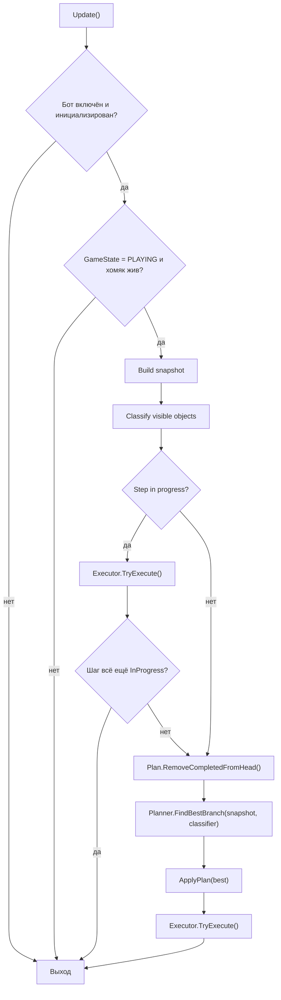
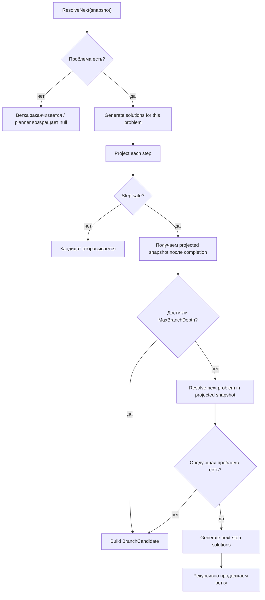

# BotV3 Planning Flow

Краткая схема текущего алгоритма планирования BotV3 после перехода на `problem -> solutions`.

## 1. Верхний цикл в runtime

Файл-оркестратор: `LostCyberHamster/Assets/Scripts/BotV3/BotOrchestrator.cs`



Смысл:

- Оркестратор каждый кадр собирает новый `snapshot`.
- Если шаг уже выполняется, сначала даёт `executor` завершить его.
- Когда активного шага больше нет, planner строит новый план по live snapshot.
- В `CurrentPlan` кладётся только голова выбранной ветки, а исполняется только первый шаг.

## 2. Что считается причиной для генерации шага

Файл: `LostCyberHamster/Assets/Scripts/BotV3/Planning/ProblemResolver.cs`

Planner больше не генерирует шаги просто потому, что на экране есть obstacle.

Теперь причина такая:

1. Берём `snapshot.VisibleObjects`.
2. Смотрим только `same-lane Threat`.
3. Находим ближайшую обязательную угрозу.
4. Превращаем её в `ProblemDescriptor`.

`ProblemDescriptor` сейчас хранит:

- `Kind`
- `SourceObstacle`
- `DecisionWorldShift`
- `Reason`

Это и есть текущий `decision point`.

## 3. Что делает planner в одном узле дерева

Файлы:

- `LostCyberHamster/Assets/Scripts/BotV3/Planning/BranchSelector.cs`
- `LostCyberHamster/Assets/Scripts/BotV3/Planning/ActionGenerator.cs`
- `LostCyberHamster/Assets/Scripts/BotV3/Planning/BranchGenerator.cs`
- `LostCyberHamster/Assets/Scripts/BotV3/Planning/BranchEvaluator.cs`



Главный инвариант:

- в каждом узле генерируются шаги только для одной явной проблемы;
- следующая проблема ищется только после проекции предыдущего шага.

## 4. Как генерируются действия

Файл: `LostCyberHamster/Assets/Scripts/BotV3/Planning/ActionGenerator.cs`

`ActionGenerator` — это реестр стратегий:

- `SwitchLaneStrategy(Earliest)`
- `SwitchLaneStrategy(Latest)`
- `JumpStrategy()`

Для текущей `ProblemDescriptor` каждая стратегия отвечает на два вопроса:

1. `CanSolve(problem)` — это вообще решение данного типа проблемы?
2. `TryBuildStep(...)` — можно ли построить конкретный safe step?

Если да, стратегия возвращает `BranchStep`.

## 5. Как работает SwitchLane

Файл: `LostCyberHamster/Assets/Scripts/BotV3/Planning/SwitchLaneStrategy.cs`

`SwitchLane` строится не по одному моменту fire, а по окну:

1. Считается дедлайн по исходной угрозе на текущей линии.
2. На target lane собираются unsafe intervals.
3. Из них вычисляются safe windows.
4. Из окна выбирается канонический fire:
   - `Earliest`
   - `Latest`
5. После этого шаг проецируется и проверяется swept safety.

Это позволяет planner видеть:

- раннее окно;
- позднее окно;
- split windows (`safe -> unsafe -> safe`).

## 6. Как работает Jump

Файл: `LostCyberHamster/Assets/Scripts/BotV3/Planning/JumpStrategy.cs`

Сейчас `Jump` ещё проще, чем `SwitchLane`:

- подходит только для small obstacles;
- требует энергию;
- использует один канонический `JumpFireDist`;
- проверяет, что landing zone после completion безопасна.

То есть `Jump` уже обёрнут в стратегию, но его timing model пока проще и жёстче, чем у `SwitchLane`.

## 7. Как выбирается лучшая ветка

Файл: `LostCyberHamster/Assets/Scripts/BotV3/Planning/BranchEvaluator.cs`

Порядок сравнения сейчас такой:

1. `AllStepsSafe`
2. `TotalEnergyCost`
3. `Steps.Count`
4. `Steps[0].FireWorldShift`

Смысл:

- сначала выживание;
- потом экономия энергии;
- потом более короткая ветка;
- потом более ранний fire как tie-break.

## 8. Как шаг исполняется в runtime

Файл: `LostCyberHamster/Assets/Scripts/BotV3/Execution/StepExecutor.cs`

`StepExecutor` не планирует заново.

Он делает только это:

1. Ждёт, пока live distance дойдёт до `ExecuteAtDistance`.
2. Отправляет runtime-команду (`TapRequest`, `JumpRequest`, `RoofJumpRequest`).
3. Отслеживает завершение шага.
4. На `SwitchLane` сверяет completion contract.
5. На `Jump` имеет live guard `ShouldDelayJumpOver()`.

Важно:

- planner отвечает за выбор шага и его timing;
- executor отвечает за фактический fire и completion в runtime.

## 9. Ключевой data flow

Если совсем коротко, текущий BotV3 работает так:

```text
Live world
-> Snapshot
-> Classify
-> Resolve current problem
-> Generate action candidates for this problem
-> Project each candidate
-> Recursively resolve next problems
-> Score branches
-> Pick head step
-> Execute only head
-> Rebuild snapshot on next cycle
```

## 10. Что важно держать в голове

- `Threat` — это категория объекта.
- `Problem` — это конкретная текущая обязательная угроза.
- `Step` появляется не сам по себе, а как ответ на `Problem`.
- `Branch` — это последовательность решений по цепочке проблем.
- Выполняется только первый шаг ветки, хвост всегда предварительный.
