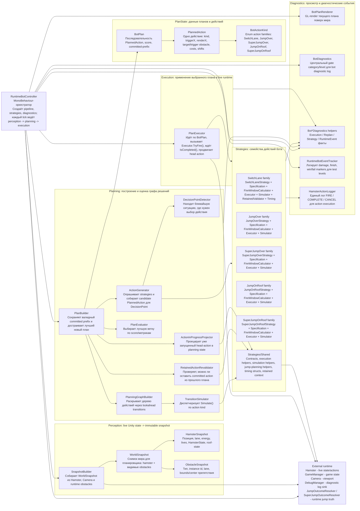
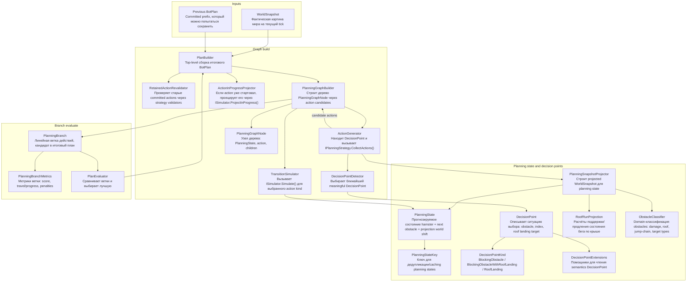
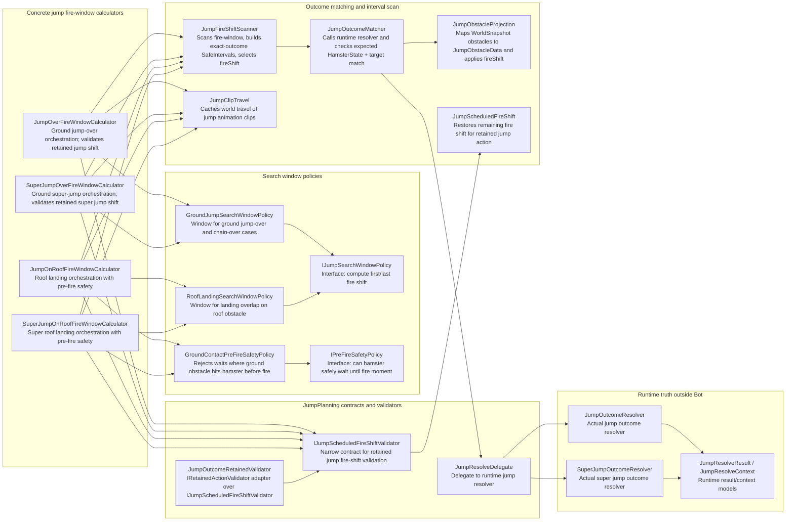
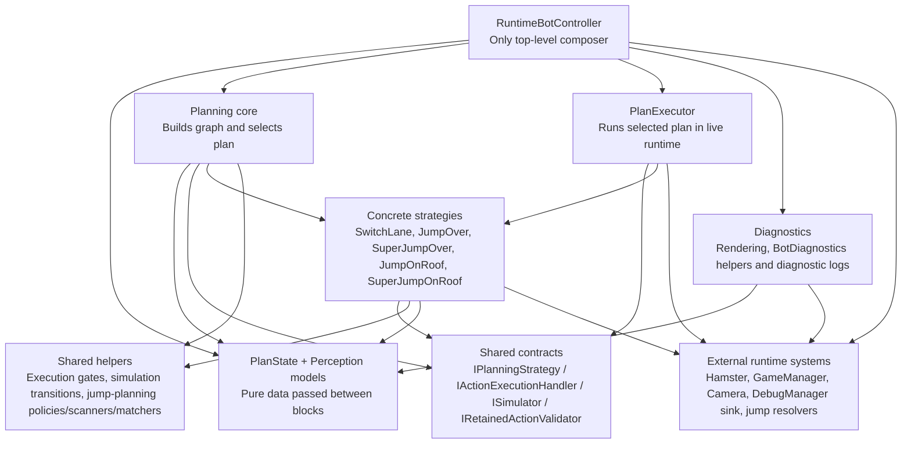

# Bot Architecture Diagram

Дата: 2026-04-29  
Папка: `LostCyberHamster/Assets/Scripts/Bot/`

Документ показывает текущую архитектуру runtime-бота: какие блоки логики есть, какие классы входят в каждый блок, кто от кого зависит и какой класс за что отвечает.

## 1. Общий pipeline

## 2. Planning internals

## 3. Strategy pattern and concrete action families

```mermaid
flowchart TB
    subgraph Contracts["Shared/Contracts: strategy ports"]
        IPS["IPlanningStrategy<br/>Strategy facade: ActionKind, Executor, RetainedValidator, Simulator, CollectActions()"]
        IAEH["IActionExecutionHandler<br/>Execution port: TryFire() and IsCompleted()"]
        ISIM["ISimulator<br/>Planning simulation port: Simulate() and ProjectInProgress()"]
        IRAV["IRetainedActionValidator<br/>Retained action port: IsStillValid(context)"]
    end

    subgraph SharedExecution["Shared/Execution: live execution helpers"]
        ATG["ActionTriggerGate<br/>Проверяет, пора ли нажимать action по live obstacle distance"]
        LOR["LiveObstacleResolver<br/>Находит live obstacle по target/trigger identifiers"]
        AFR["ActionFireResult<br/>Execution result enum: in-progress, success, failed"]
        RAC["RetainedActionContext<br/>Контекст для проверки старого action: state, projected snapshot, target obstacle"]
    end

    subgraph SharedSimulation["Shared/Simulation and Timing"]
        PST["PlanningStateTransition<br/>Чистые переходы planning state после успешного action"]
        IPH["InProgressProjectionHelper<br/>Общий расчёт projection для уже запущенного head action"]
        AIP3["ActionInProgressProjector<br/>Диспетчер ProjectInProgress() по action kind"]
        SI["SafeInterval<br/>Безопасный timing interval с выбором interior point"]
        UI["UnsafeInterval<br/>Опасный timing interval для safety calculations"]
    end

    subgraph SwitchLane["SwitchLane family"]
        SLS["SwitchLaneStrategy<br/>Создаёт SwitchLane candidates для смены линии"]
        SLSPEC["SwitchLaneSpecification<br/>Проверяет применимость смены линии к DecisionPoint"]
        SLFW["SwitchLaneFireWindowCalculator<br/>Ищет safe window на target lane"]
        SLEX["SwitchLaneExecutor<br/>Нажимает смену линии и ждёт завершения shift"]
        SLSIM["SwitchLaneSimulator<br/>Прогнозирует lane/state после смены линии"]
        SLVAL["SwitchLaneRetainedValidator<br/>Проверяет, ещё валиден ли сохранённый SwitchLane"]
        SLTIM["SwitchLaneTiming<br/>Константы decision travel и timing для SwitchLane"]
    end

    subgraph JumpOver["JumpOver family"]
        JOS["JumpOverStrategy<br/>Создаёт обычный прыжок через ground obstacle"]
        JOSPEC["JumpOverSpecification<br/>Фильтрует obstacles, которые можно перепрыгнуть обычным jump"]
        JOFW["JumpOverFireWindowCalculator<br/>Ищет fire shift для outcome JumpOver"]
        JOEX["JumpOverExecutor<br/>Нажимает jump и ждёт state/completion"]
        JOSIM["JumpOverSimulator<br/>Прогнозирует Run state после прыжка через obstacle"]
    end

    subgraph SuperJumpOver["SuperJumpOver family"]
        SJOS["SuperJumpOverStrategy<br/>Создаёт super jump через ground obstacle"]
        SJOSPEC["SuperJumpOverSpecification<br/>Фильтрует obstacles для super jump-over"]
        SJOFW["SuperJumpOverFireWindowCalculator<br/>Ищет fire shift для outcome SuperJumpOver"]
        SJOEX["SuperJumpOverExecutor<br/>Нажимает super jump и контролирует завершение"]
        SJOSIM["SuperJumpOverSimulator<br/>Прогнозирует state после super jump-over"]
    end

    subgraph JumpOnRoof["JumpOnRoof family"]
        JORS["JumpOnRoofStrategy<br/>Создаёт jump на roof obstacle"]
        JORSPEC["JumpOnRoofSpecification<br/>Проверяет roof landing applicability"]
        JORFW["JumpOnRoofFireWindowCalculator<br/>Ищет fire shift для landing на крышу"]
        JOREX["JumpOnRoofExecutor<br/>Нажимает jump-on-roof и ждёт roof state"]
        JORSIM["JumpOnRoofSimulator<br/>Прогнозирует RoofRun после посадки"]
    end

    subgraph SuperJumpOnRoof["SuperJumpOnRoof family"]
        SJORS["SuperJumpOnRoofStrategy<br/>Создаёт super jump на roof obstacle"]
        SJORSPEC["SuperJumpOnRoofSpecification<br/>Проверяет roof landing для super jump"]
        SJORFW["SuperJumpOnRoofFireWindowCalculator<br/>Ищет fire shift для SuperJumpOnRoof outcome"]
        SJOREX["SuperJumpOnRoofExecutor<br/>Нажимает super jump-on-roof и контролирует state"]
        SJORSIM["SuperJumpOnRoofSimulator<br/>Прогнозирует RoofRun после super roof landing"]
    end

    IPS --> SLS
    IPS --> JOS
    IPS --> SJOS
    IPS --> JORS
    IPS --> SJORS

    SLS --> SLSPEC
    SLS --> SLFW
    SLS --> SLEX
    SLS --> SLSIM
    SLS --> SLVAL
    SLS --> SLTIM

    JOS --> JOSPEC
    JOS --> JOFW
    JOS --> JOEX
    JOS --> JOSIM

    SJOS --> SJOSPEC
    SJOS --> SJOFW
    SJOS --> SJOEX
    SJOS --> SJOSIM

    JORS --> JORSPEC
    JORS --> JORFW
    JORS --> JOREX
    JORS --> JORSIM

    SJORS --> SJORSPEC
    SJORS --> SJORFW
    SJORS --> SJOREX
    SJORS --> SJORSIM

    SLEX --> IAEH
    JOEX --> IAEH
    SJOEX --> IAEH
    JOREX --> IAEH
    SJOREX --> IAEH

    SLSIM --> ISIM
    JOSIM --> ISIM
    SJOSIM --> ISIM
    JORSIM --> ISIM
    SJORSIM --> ISIM

    SLVAL --> IRAV
    ATG --> LOR
    IAEH --> AFR
    IRAV --> RAC
    ISIM --> PST
    ISIM --> IPH
    AIP3 --> ISIM
```

## 4. Jump-planning internals

## 5. Dependency summary by direction

